<p align="center">
  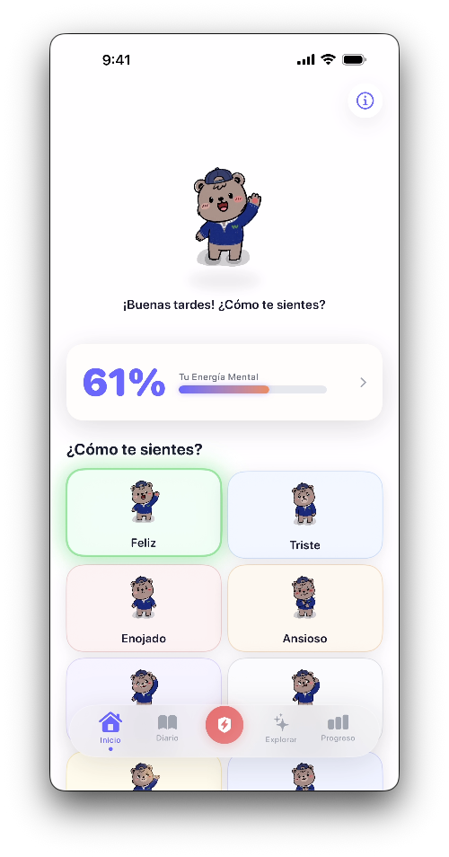
</p>

<h1 align="center">TeddyFeels</h1>

<p align="center">
  <strong>An emotional wellness companion for children — built entirely in SwiftUI.</strong>
</p>

<p align="center">
  
  
  
  
  
  
  
  
</p>

---

## About

**TeddyFeels** is a native iOS app designed to help children (ages 6-12) identify, express, and manage their emotions through a friendly bear companion. Children choose a character — **Dan** or **Dani** — and interact with them throughout the app via emotion check-ins, a private journal, goal tracking, educational content, and an emergency SOS mode.

The app is rooted in established psychological research (Goleman's Emotional Intelligence, Winnicott's Transitional Object Theory, Pennebaker's Expressive Writing) and follows **Apple Human Interface Guidelines** with a child-safe, COPPA-compliant design.

> Built as an educational innovation project at **Colegio Walden Dos de Mexico**.

---

## Key Features

| Feature | Description |
|---------|-------------|
| **Emotion Check-In** | 9 emotions with unique animated bear expressions, personalized action recommendations, and celebratory confetti |
| **Mental Energy Score** | Real-time wellbeing tracker with animated progress bar and weekly analytics dashboard |
| **Private Journal** | PIN-protected diary with text and voice recording — all data stored locally on-device |
| **Goal Tracker** | Set personal goals, track progress with a visual ring, and celebrate completions with confetti |
| **3:1 Positivity Rule** | Interactive seesaw game teaching Barbara Fredrickson's positivity ratio |
| **SOS Rescue Mode** | Full-screen emergency breathing exercise with guided inhale/exhale animation |
| **Dual Characters** | Choose between Dan (male) or Dani (female) — each with unique voice and gendered bear assets |
| **Adaptive Layout** | Fully responsive design — 2-column grid on iPhone, 3-column on iPad |
| **Dark Mode Journal** | Diary automatically switches to a dark, cozy theme for a safe writing space |
| **Risk Detection** | Built-in keyword detection to flag concerning entries and activate protective measures |

---

## Screenshots

### iPhone

<p align="center">
  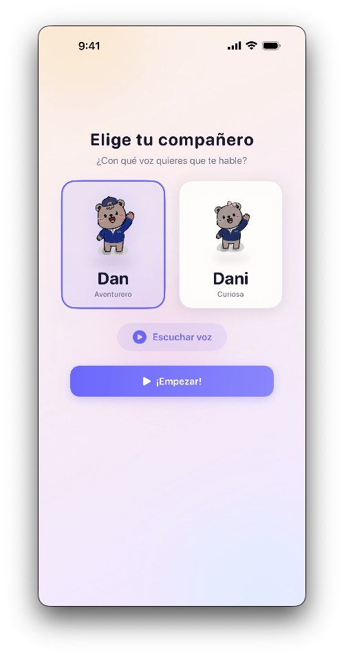
  &nbsp;&nbsp;
  
  &nbsp;&nbsp;
  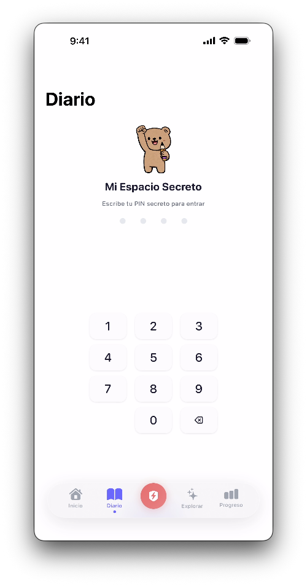
  &nbsp;&nbsp;
  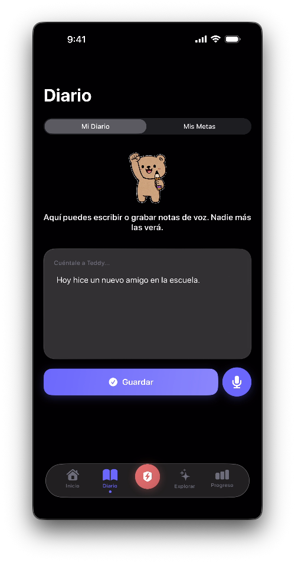
</p>
<p align="center">
  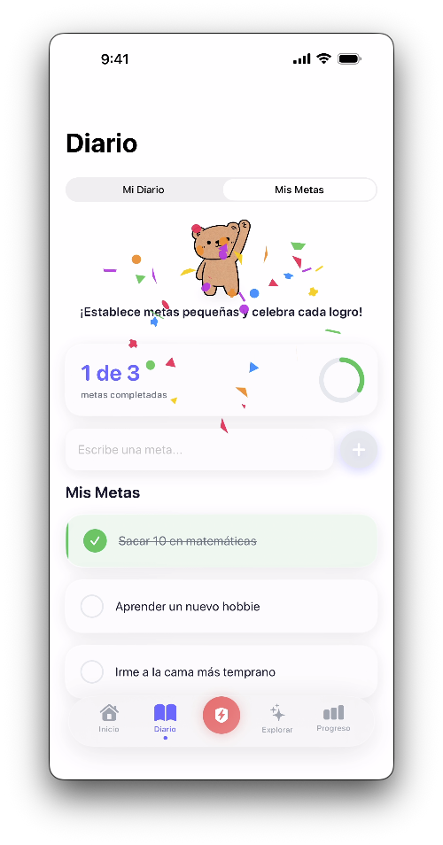
  &nbsp;&nbsp;
  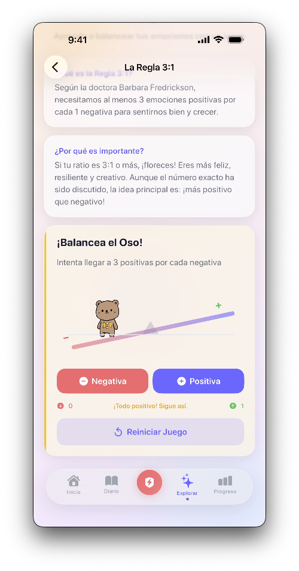
  &nbsp;&nbsp;
  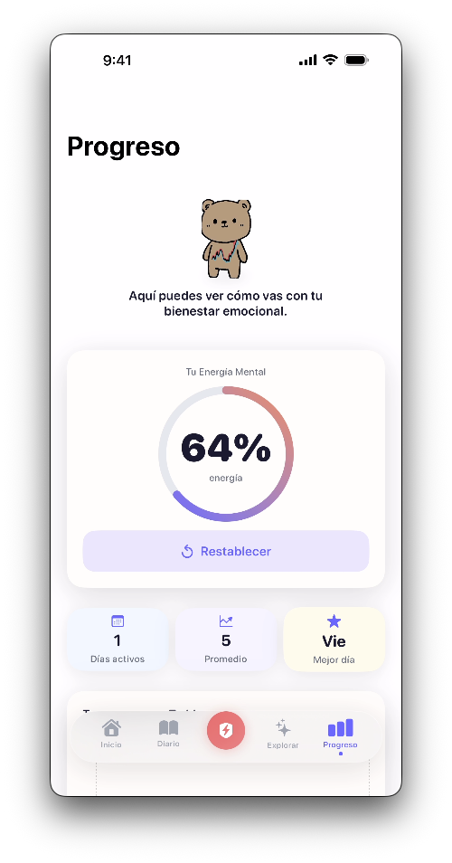
  &nbsp;&nbsp;
  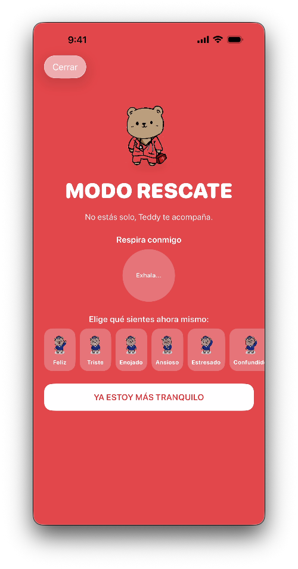
</p>

### iPad

<p align="center">
  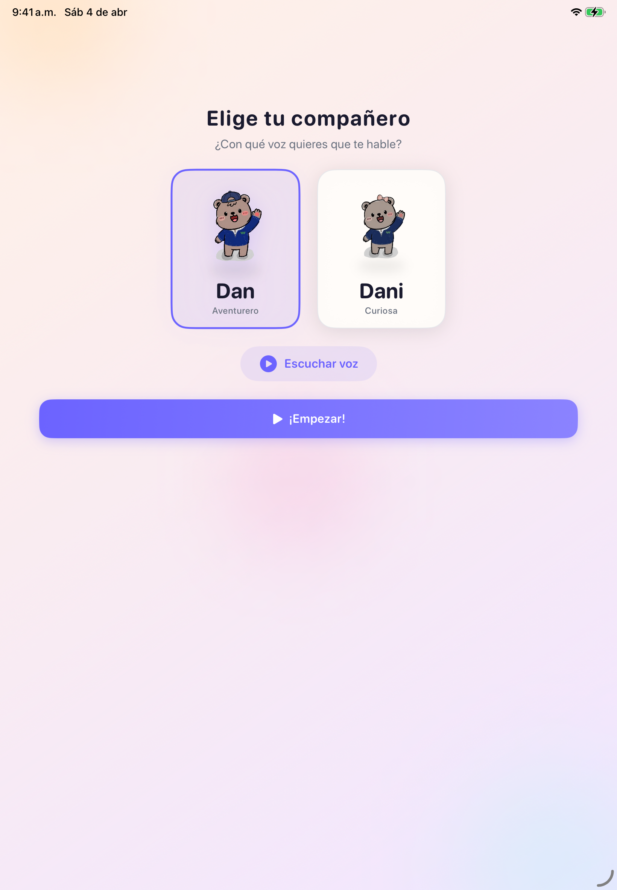
  &nbsp;&nbsp;
  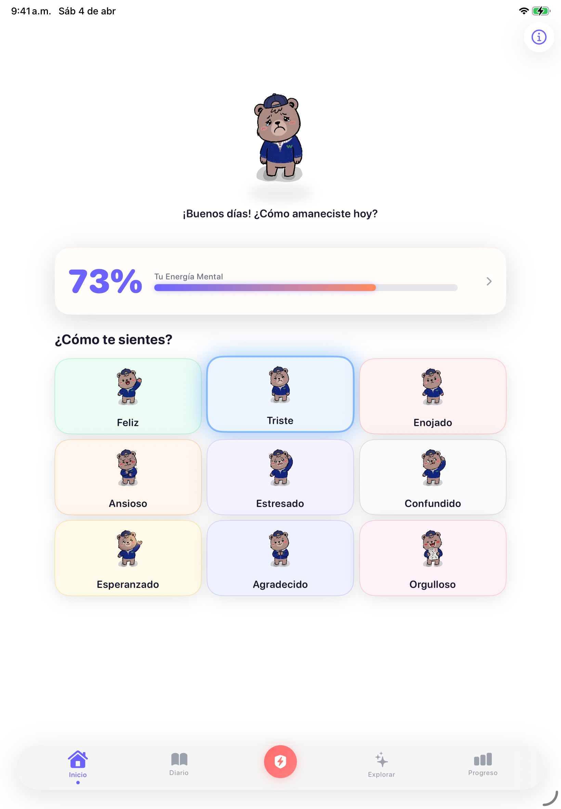
  &nbsp;&nbsp;
  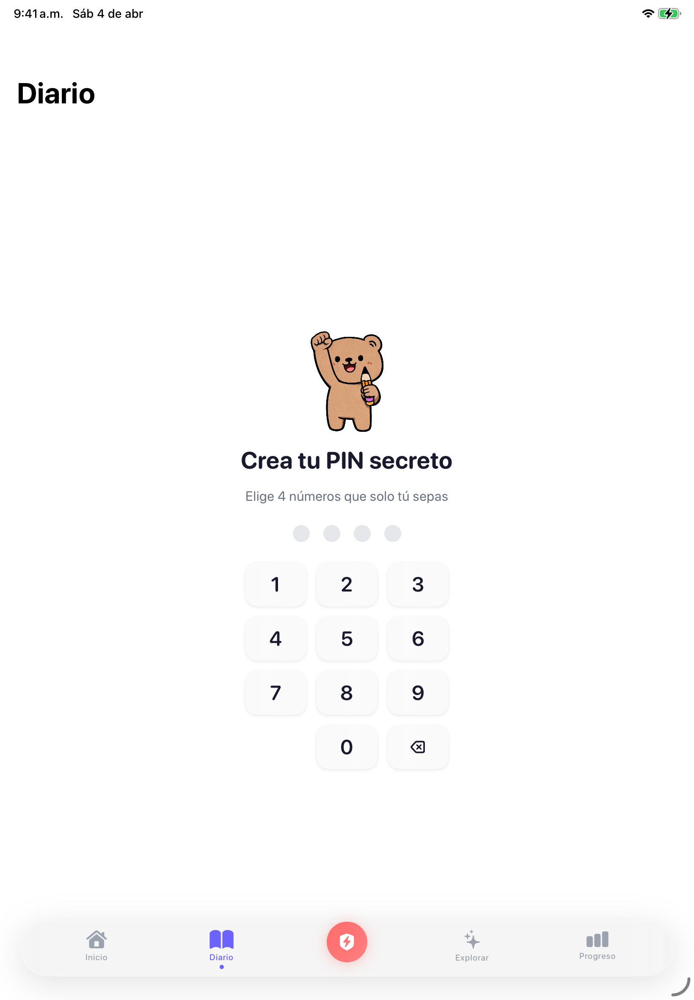
</p>
<p align="center">
  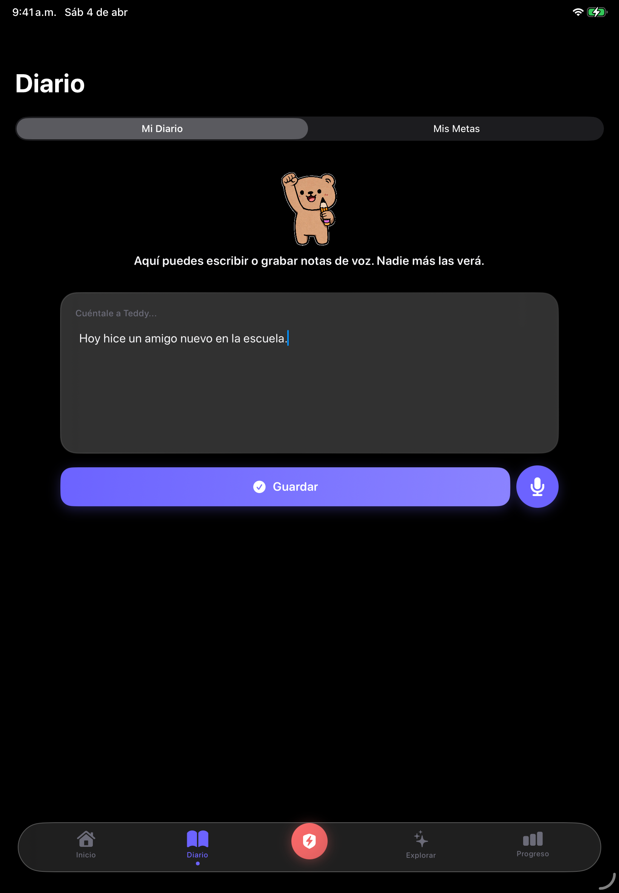
  &nbsp;&nbsp;
  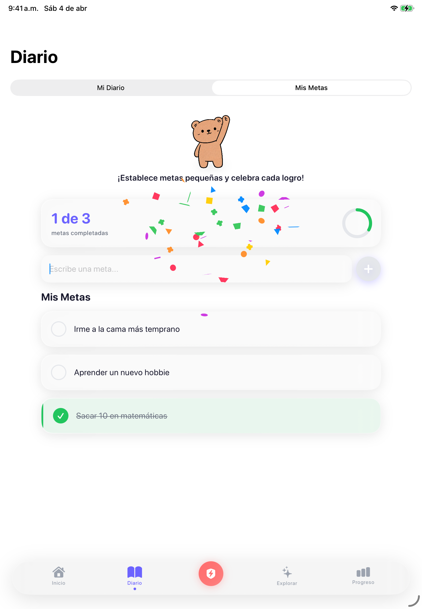
  &nbsp;&nbsp;
  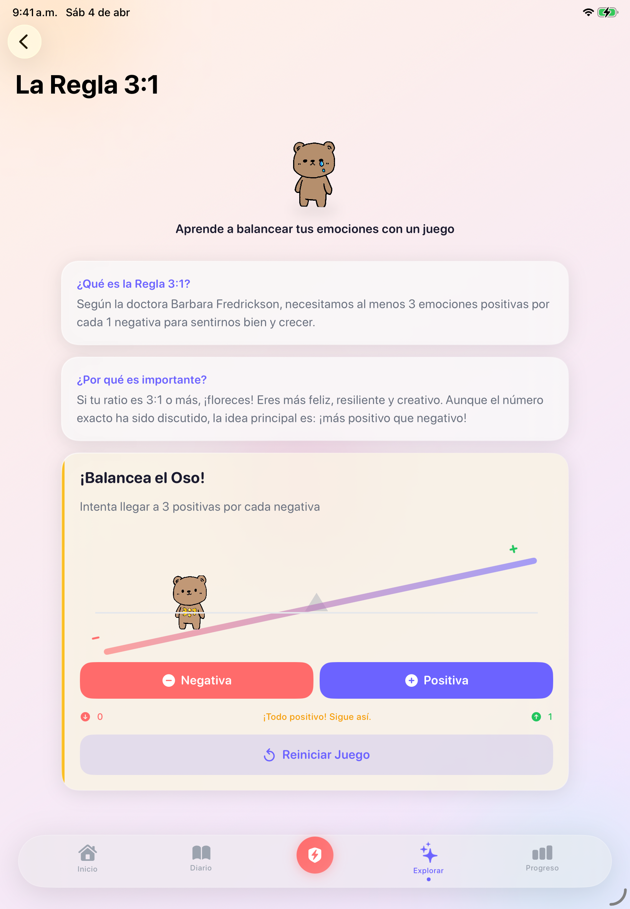
  &nbsp;&nbsp;
  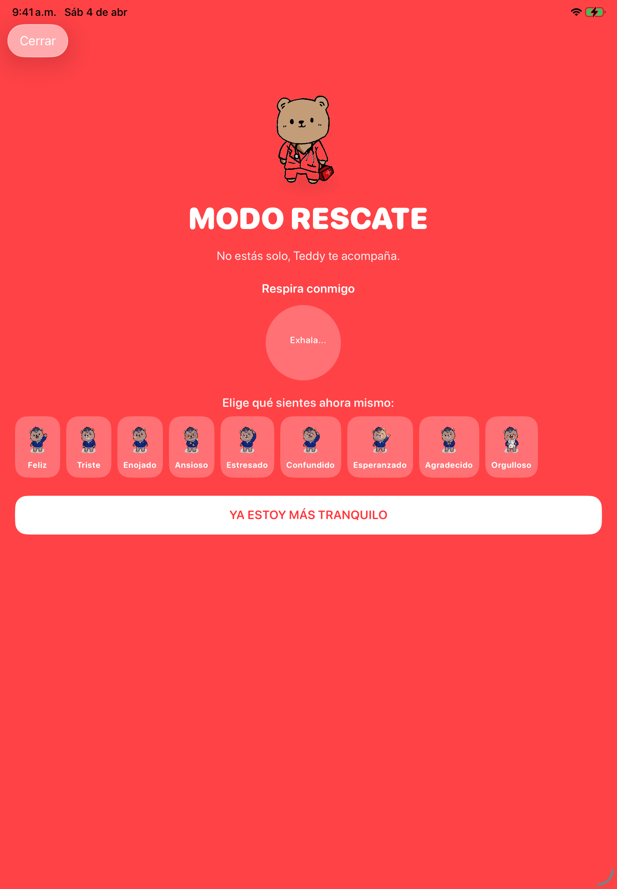
</p>

---

## Architecture & Tech Stack

```
TeddyFeels/
├── App/                  # App entry point, theme & design system
├── Models/               # Emocion, EntradaDiario, Meta, Accion
├── ViewModels/           # EmotionViewModel, DiarioViewModel (MVVM)
├── Views/
│   ├── Home/             # Main emotion check-in screen
│   ├── Diary/            # PIN-protected journal & goals
│   ├── Explorar/         # Tips, 3:1 rule, about section
│   ├── Analytics/        # Progress dashboard & weekly charts
│   ├── SOS/              # Emergency rescue mode
│   ├── Onboarding/       # Character picker & intro
│   ├── DesignSystem/     # Reusable UI components
│   └── Settings/         # Privacy policy
├── Services/             # BearVoice, DailyScore, PIN, RiskDetection, Transcription
├── Data/                 # Static research & tips content
└── Extensions/           # SwiftUI view modifiers & helpers
```

### Technologies Used

| Technology | Purpose |
|:---:|:---:|
| <br>**SwiftUI** | Declarative UI framework — entire app is 100% SwiftUI |
| <br>**Swift 5** | Primary language — `@Observable`, strict concurrency |
| <br>**SwiftData** | On-device persistence for diary entries and goals |
| <br>**AVFoundation** | Audio playback for bear character voices |
| <br>**Speech** | Voice-to-text transcription for voice journal entries |

### Third-Party Libraries (Swift Package Manager)

| Library | Version | Purpose |
|---------|:-------:|---------|
| [ConfettiSwiftUI](https://github.com/simibac/ConfettiSwiftUI) | 1.1.0 | Celebration particle effects on emotion selection and goal completion |
| [Lottie](https://github.com/airbnb/lottie-ios) | 4.6.0 | Rich vector animations for onboarding and transitions |
| [SwiftUI-Shimmer](https://github.com/markiv/SwiftUI-Shimmer) | 1.5.1 | Shimmer loading effects for cards and UI elements |
| [Vortex](https://github.com/twostraws/Vortex) | 1.0.4 | GPU-accelerated particle system for animated backgrounds |

---

## Design Highlights

- **Custom Design System** — `TeddyTheme` provides a unified palette of warm colors, rounded typography (`.rounded` design), and consistent spacing tokens
- **Emotion-Reactive UI** — Background particles and colors dynamically shift based on the selected emotion
- **Floating Tab Bar** — Frosted-glass capsule tab bar with a central SOS emergency button
- **Child-Safe Architecture** — All data is stored locally (zero network calls), PIN-protected diary, COPPA & GDPR compliant
- **Haptic Feedback** — Tactile responses on every interaction using `UIImpactFeedbackGenerator`
- **Spring Animations** — Every transition uses custom spring physics for a playful, organic feel

---

## Requirements

| Requirement | Version |
|-------------|---------|
| iOS | 26.0+ |
| Xcode | 26+ |
| Swift | 5.0 |
| Devices | iPhone & iPad (Universal) |

## Getting Started

```bash
git clone https://github.com/arzaluz-chris/TeddyFeels.git
cd TeddyFeels
open TeddyFeels.xcodeproj
```

Select your target device and hit **Run** (Cmd + R). No additional setup required — all dependencies are managed via Swift Package Manager and resolve automatically.

---

## Project Stats

| Metric | Value |
|--------|-------|
| Swift Files | 57 |
| Lines of Code | ~5,400+ |
| Emotions Tracked | 9 |
| Custom Bear Assets | 30+ |
| App Iterations | 70+ versions |

---

## Author

**Christian Daniel Arzaluz Tellez**

Lead Developer & Designer

---

<p align="center">
  <sub>Built with care at <strong>Colegio Walden Dos de Mexico</strong></sub>
</p>
